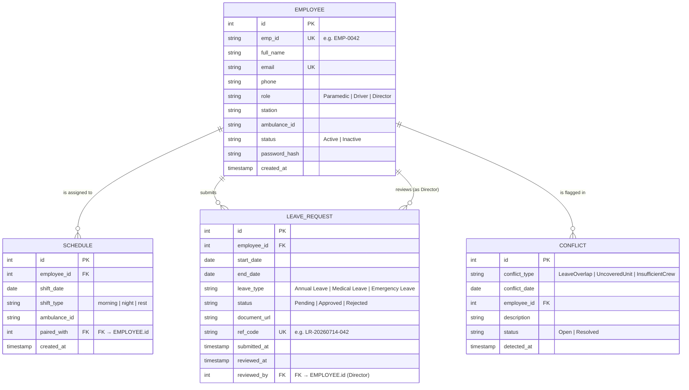

# ER Diagram

## Mermaid Source

## Export Instructions

1. Open [https://mermaid.live](https://mermaid.live)
2. Paste the Mermaid source above into the editor
3. Click **Export → PNG**
4. Save the file as `er-diagram.png` in this folder (`design/`)
